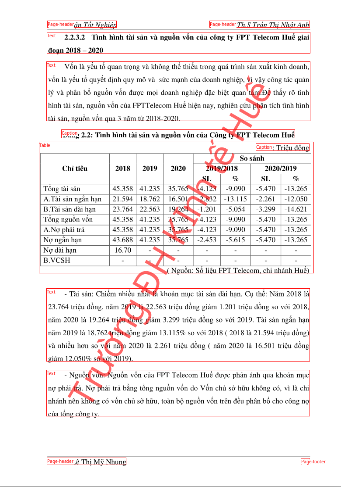
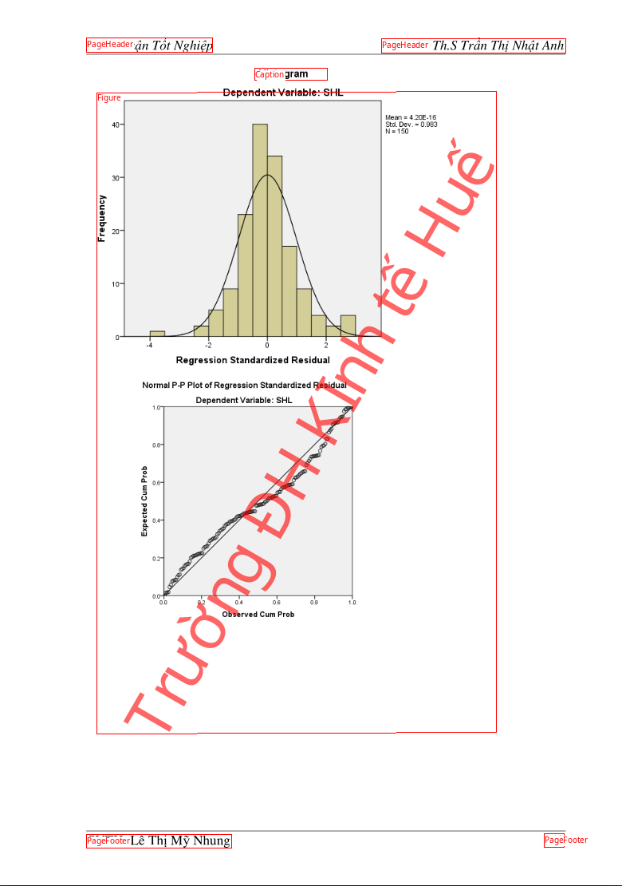

# Surya Layout Api


## Require 
- fastapi 
- uvicorn
- surya-ocr

## Routes

- `/detect_layout/`
  - Return layout in json format
- `/detect_layout/?return_image=true`
  - Return image of detected layout bboxes

## Run
- make venv
- install requirements
- run

```bash
python -m uvicorn app:app --port 5000
```

- use curl 

```bash
curl -X POST -F "file=@text1.png" http://127.0.0.1:5000/detect_text/ -Lo out.text1.json
curl -X POST -F "file=@img1.png" http://127.0.0.1:5000/detect_layout/ -Lo out.img1.json
curl -X POST -F "file=@img1.png" http://127.0.0.1:5000/detect_layout/\?return_image\=true -Lo out.img1.png
curl -X POST -F "file=@img2.png" http://127.0.0.1:5000/detect_layout/ -Lo out.img2.json
curl -X POST -F "file=@img2.png" http://127.0.0.1:5000/detect_layout/\?return_image\=true -Lo out.img2.png
curl -X POST -F "file=@img.png" http://127.0.0.1:5000/detect_layout/ -Lo out.img.json
curl -X POST -F "file=@img.png" http://127.0.0.1:5000/detect_layout/\?return_image\=true -Lo out.img.png
```

- output image





## Setup service systemd

```bash
# Di chuyển đến thư mục dự án của bạn
cd /path/to/your/project

# Tạo virtual environment
python3 -m venv venv

# Kích hoạt virtual environment
source venv/bin/activate

# Cài đặt các thư viện cần thiết
pip install fastapi uvicorn surya-ocr pillow
```

- `sudo nano /etc/systemd/system/my_fastapi_service.service`

```bash
[Unit]
Description=FastAPI Service
After=network.target

[Service]
User =your_username
Group=your_groupname
WorkingDirectory=/path/to/your/project
Environment="PATH=/path/to/your/project/venv/bin"
ExecStart=/path/to/your/project/venv/bin/uvicorn your_script_name:app --host 0.0.0.0 --port 8000

[Install]
WantedBy=multi-user.target
```