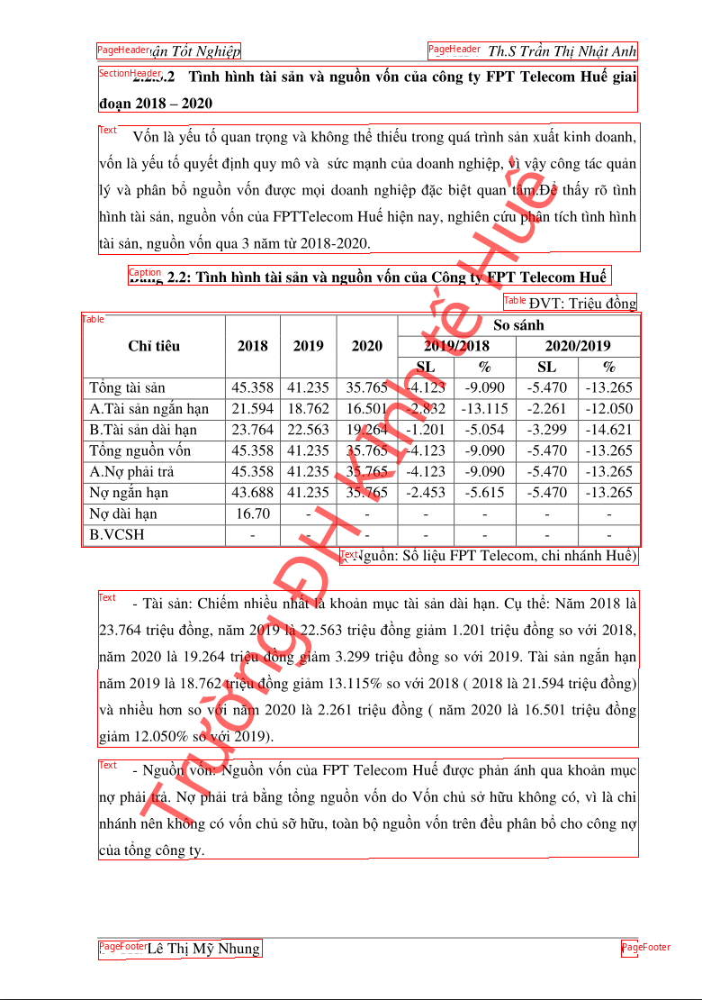

# Surya Layout Api


## Require 
- fastapi 
- uvicorn
- surya-ocr

## Routes

- `/detect_layout/`
  - Return layout in json format
- `/detect_layout/?return_image=true`
  - Return image of detected layout bboxes

## Run
- make venv
- install requirements
- run

```bash
python -m uvicorn app:app --port 5000
```

- use curl 

```bash
curl -X POST -F "file=@img1.png" http://127.0.0.1:5000/detect_layout/ -Lo out.img1.json
curl -X POST -F "file=@img1.png" http://127.0.0.1:5000/detect_layout/\?return_image\=true -Lo out.img1.png
curl -X POST -F "file=@img2.png" http://127.0.0.1:5000/detect_layout/\?return_image\=true -Lo out.img2.png
curl -X POST -F "file=@img2.png" http://127.0.0.1:5000/detect_layout/ -Lo out.img2.json
```

- output image


